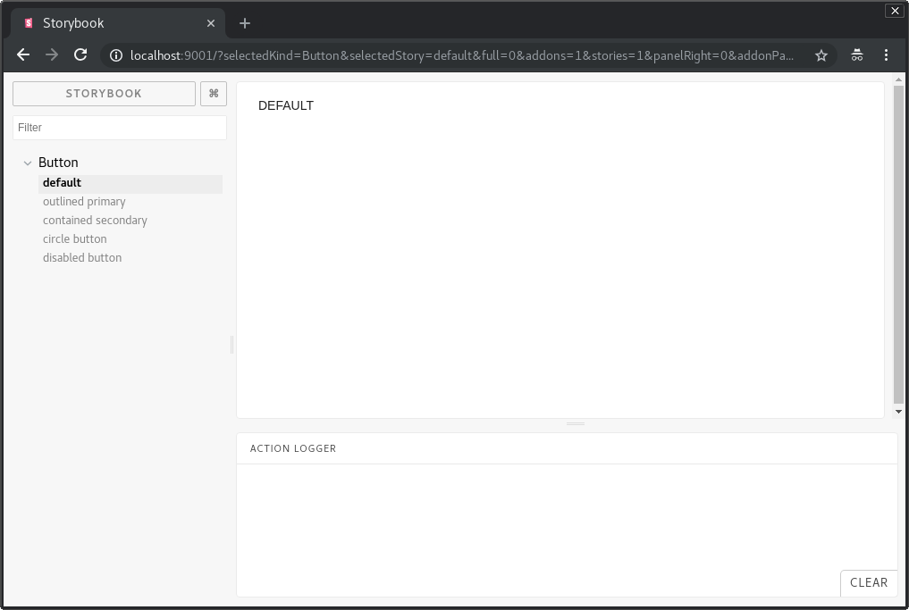

[](https://travis-ci.com/leksster/nextjs6-graphql-client-tutorial)

# Nextjs6 with Apollo Graphql and Material-UI Tutorial

## Step 1 - Yarn installation

There are two options how to install Yarn. The first option is to use npm:

```bash
npm install -g yarn
```

Another option is to go to the official download page and get the installer for your operating system and run it.

The other method would be to go to [the official download page](https://yarnpkg.com/en/docs/install) and get the installer for your operating system and run it.

## Step 2 - Project initialization

To start, create a sample project by running the following commands:

```bash
mkdir github-client
cd github-client
yarn init
yarn add react react-dom prop-types next
mkdir pages
```

Then open the "package.json" in the github-client directory and add the following script.

```
{
  "scripts": {
    "dev": "next"
  }
}
```

Everything is ready. To start the dev server, you need to run the following command:

```bash
yarn dev
```

When you run `localhost:3000` you will see this page:


## Step 3 - Babel Installation

Babel is a toolchain that is mainly used to convert ECMAScript 2015+ code into a backwards compatible version of JavaScript in old browsers or environments.

To install babel compiler core use command:

```bash
yarn add babel-core -D
```

#### Babel module resolver

A Babel plugin to add a new resolver for your modules when compiling your code using Babel. This plugin allows you to add new "root" directories that contain your modules. It also allows you to setup a custom alias for directories, specific files, or even other npm modules.

Let's install babel module resolver.

```bash
yarn add babel-plugin-module-resolver -D
```

After that we need to update `.babelrc` config. So we can import dependencies without declaring related path.

`.babelrc`

```js
"plugins": [
  ["module-resolver", {
    "root": ["./"],
    "alias": {
      "components": "./components",
      "containers": "./containers",
      "queries": "./graphql/queries"
    }
  }]
]
```

This allows us to make this:

```js
import { Home } from 'components';
```

Instead of this:

```js
import { Home } from '../../components';
```

## Step 4 Linters configuration

To avoid big refactoring in the future, you need to integrate linters to your app. For that, add eslint as development dependency:

```bash
yarn add eslint -D
```

You need a wrapper for babel’s parser used for eslint. Use yarn to install package:

```bash
yarn add babel-eslint -D
```

Babel-eslint allows you to lint ALL valid Babel code

There are few dependencies that you have to install.
This package provides Airbnb's .eslintrc as an extensible shared config.

```bash
yarn add eslint-config-airbnb -D
```

Install ESLint plugin with rules that help validate proper imports.

```bash
yarn add eslint-plugin-import -D
```

Install Static AST checker for accessibility rules on JSX elements.

```bash
yarn add eslint-plugin-jsx-a11y -D
```

Install eslint plugin for React.

```bash
yarn add eslint-plugin-react -D
```

Initialize eslint config.

```bash
yarn run eslint --init
```

We're going to use airbnb eslint config.

Choose the following settings:

How would you like to configure ESLint? `Use a popular style guide`
Which style guide do you want to follow? `Airbnb`
Do you use React? `Yes`
What format do you want your config file to be in? `JSON`
Would you like to install them now with npm? `No`

Now we have `.eslintrc.json` with the following configuration

```js
{
  "extends": "airbnb"
}
```

We're going to use `.js` extensions instead of `.jsx` because JSX is not standard JS, and is not likely to ever be. So we explicitly add this option to the `.eslintc.json`:

```js
{
  "parser": "babel-eslint",
  "rules": {
    "react/jsx-filename-extension": ["error", { "extensions": [".js", ".jsx"] }]
  },
  "extends": "airbnb"
}
```

## Step 5 - Material UI integration

In a nutshell, Material-UI is an open-source project that features React components that implement Google’s Material Design.

It kick-started in 2014, not long after React came out to the public, and has grown in popularity ever since. With over 35,000 stars on GitHub, Material-UI is one of the top user interface libraries for React out there.

There are few additional steps that we need to apply before start using material with NextJS framework

First of all install some additional packages.

#### Install JSS:

```
yarn add jss
```

JSS is a more powerful abstraction than CSS. It uses JavaScript as a language to describe styles in a declarative and maintainable way. It is a high performance JS to CSS compiler which works at runtime and server-side.

#### Install react-jss:

```
yarn add react-jss
```

We use React-JSS because it provides components for JSS as a layer of abstraction and has the following range of benefits compared to lower level core:

- Theming support.
- Critical CSS extraction.
- Lazy evaluation - sheet is created only when the component will mount.
- Auto attach/detach - sheet will be rendered to the DOM when the component is about to mount, and will be removed when no element needs it.
- A Style Sheet gets shared between all elements.
- Function values and rules are updated automatically with props.

#### Install styled-jsx package for server-side rendering:

```
yarn add styled-jsx
```

Styled-jsx is a full, scoped and component-friendly CSS support for JSX (rendered on the server or the client).

#### Install material core with icons

```
yarn add @material-ui/core @material-ui/icons
```

@material-ui/core is a set of react components that implement Google's Material Design.
@materail-ui/icons is a set of components with svg icons

There is an example app that shows how to properly integrate material-ui specifically for nextjs framework. https://github.com/mui-org/material-ui/tree/master/examples/nextjs

Now create `lib/getPageContext.js`

```js
/* eslint-disable no-underscore-dangle */

import { SheetsRegistry } from 'jss';
import { createMuiTheme, createGenerateClassName } from '@material-ui/core/styles';

// A theme with custom primary and secondary color.
// It's optional.
const theme = createMuiTheme();

function createPageContext() {
  return {
    theme,
    // This is needed in order to deduplicate the injection of CSS in the page.
    sheetsManager: new Map(),
    // This is needed in order to inject the critical CSS.
    sheetsRegistry: new SheetsRegistry(),
    // The standard class name generator.
    generateClassName: createGenerateClassName(),
  };
}

export default function getPageContext() {
  // Make sure to create a new context for every server-side request so that data
  // isn't shared between connections (which would be bad).
  if (!process.browser) {
    return createPageContext();
  }

  // Reuse context on the client-side.
  if (!global.__INIT_MATERIAL_UI__) {
    global.__INIT_MATERIAL_UI__ = createPageContext();
  }

  return global.__INIT_MATERIAL_UI__;
}
```

Next.js uses the App component to initialize pages. You can override it and control the page initialization. Which allows you to do amazing things like:

- Persisting layout between page changes
- Keeping state when navigating pages
- Custom error handling using componentDidCatch
- Inject additional data into pages (for example by processing GraphQL queries)

To override, create the `./pages/_app.js` file and override the App class as shown below:

```js
import React from 'react';
import App, { Container } from 'next/app';
import { MuiThemeProvider } from '@material-ui/core/styles';
import CssBaseline from '@material-ui/core/CssBaseline';
import JssProvider from 'react-jss/lib/JssProvider';
import getPageContext from '../lib/getPageContext';

class MainApp extends App {
  constructor(props) {
    super(props);
    this.pageContext = getPageContext();
  }

  pageContext = null;

  componentDidMount() {
    // Remove the server-side injected CSS.
    const jssStyles = document.querySelector('#jss-server-side');
    if (jssStyles && jssStyles.parentNode) {
      jssStyles.parentNode.removeChild(jssStyles);
    }
  }

  render() {
    const { Component, pageProps } = this.props;
    return (
      <Container>
        {/* Wrap every page in Jss and Theme providers */}
        <JssProvider
          registry={this.pageContext.sheetsRegistry}
          generateClassName={this.pageContext.generateClassName}
        >
          {/* MuiThemeProvider makes the theme available down the React
              tree thanks to React context. */}
          <MuiThemeProvider
            theme={this.pageContext.theme}
            sheetsManager={this.pageContext.sheetsManager}
          >
            {/*
              CssBaseline kickstart an elegant, consistent, and simple baseline to build upon.
            */}
            <CssBaseline />
            {/*
              Pass pageContext to the _document though the renderPage enhancer to render collected styles on server side.
            */}
            <Component pageContext={this.pageContext} {...pageProps} />
          </MuiThemeProvider>
        </JssProvider>
      </Container>
    );
  }
}

export default MainApp;
```

You need to add this line to `.eslintrc.json` to avoid `document is not defined` error:

```
"env": {
  "browser": true
```

Pages in Next.js skip the definition of the surrounding document's markup. For example, you never include `<html>`, `<body>`, etc. To override that default behavior, you must create a file at `./pages/_document.js`, where you can extend the Document class.

You need to use codebase from the material-ui official repo example with nextjs:

```js
import React from 'react';
import PropTypes from 'prop-types';
import Document, { Head, Main, NextScript } from 'next/document';
import flush from 'styled-jsx/server';

class MainDocument extends Document {
  render() {
    const { pageContext } = this.props;

    return (
      <html lang="en" dir="ltr">
        <Head>
          <title>Github Client</title>
          <meta charSet="utf-8" />
          {/* Use minimum-scale=1 to enable GPU rasterization */}
          <meta
            name="viewport"
            content={
              'user-scalable=0, initial-scale=1, '
              + 'minimum-scale=1, width=device-width, height=device-height'
            }
          />
          {/* PWA primary color */}
          <meta name="theme-color" content={pageContext.theme.palette.primary.main} />
          <link
            rel="stylesheet"
            href="https://fonts.googleapis.com/css?family=Roboto:300,400,500"
          />
        </Head>
        <body>
          <Main />
          <NextScript />
        </body>
      </html>
    );
  }
}

MainDocument.getInitialProps = (ctx) => {
  // Resolution order
  //
  // On the server:
  // 1. app.getInitialProps
  // 2. page.getInitialProps
  // 3. document.getInitialProps
  // 4. app.render
  // 5. page.render
  // 6. document.render
  //
  // On the server with error:
  // 1. document.getInitialProps
  // 2. app.render
  // 3. page.render
  // 4. document.render
  //
  // On the client
  // 1. app.getInitialProps
  // 2. page.getInitialProps
  // 3. app.render
  // 4. page.render

  // Render app and page and get the context of the page with collected side effects.
  let pageContext;

  const page = ctx.renderPage((Component) => {
    const WrappedComponent = (props) => {
      ({ pageContext } = props);

      return <Component {...props} />;
    };

    WrappedComponent.propTypes = {
      pageContext: PropTypes.shape({}).isRequired,
    };

    return WrappedComponent;
  });

  return {
    ...page,
    pageContext,
    // Styles fragment is rendered after the app and page rendering finish.
    styles: (
      <React.Fragment>
        <style
          id="jss-server-side"
          // eslint-disable-next-line react/no-danger
          dangerouslySetInnerHTML={{ __html: pageContext.sheetsRegistry.toString() }}
        />
        {flush() || null }
      </React.Fragment>
    ),
  };
};

export default MainDocument;
```

Now we're ready to implement some pages with components.

## Step 6 Storybook Integration

Storybook is a development environment for UI components. It allows you to browse a component library, view the different states of each component, and interactively develop and test components.

Here you can find a [Startguide](https://storybook.js.org/basics/guide-react) for react.

First of all, you need to add `@storybook/react` to your project. To do that, simply run:

```bash
yarn add @storybook/react -D
```

Then add the following script to your package json in order to start the storybook later in this guide:

```json
{
  "scripts": {
    "storybook": "start-storybook -p 9001 -c .storybook"
  }
}
```

After that, create the config file.

Storybook can be configured in several different ways. That’s why we need a config directory. We’ve added a -c option to the above script mentioning .storybook as the config directory.

For the basic Storybook configuration file, you don’t need to do much, but simply tell Storybook where to find stories.

For that, simply create a file at .storybook/config.js with the following content:

```js
import { configure } from '@storybook/react';

const req = require.context('../components', true, /stories\.js$/);

function loadStories() {
  req.keys().forEach(req)
}

configure(loadStories, module);
```

Here we use Webpack’s require.context to load modules dynamically. You can learn a lot of interesting things about how to use require.context if you take a look at the relevant Webpack docs.

So, we need to add babel plugin to make it work.

```bash
yarn add babel-plugin-require-context-hook -D
```

Update babel config:

`.babelrc`

```js
"test": {
  "presets": ["react", "env", "stage-0"],
  "plugins": [
    "require-context-hook"
  ]
}
```

Initialize require context hook in testConfig:

`lib/testConfig.js`

```js
import { configure } from 'enzyme';
import Adapter from 'enzyme-adapter-react-16';
import registerRequireContextHook from 'babel-plugin-require-context-hook/register';

registerRequireContextHook();

export default configure({ adapter: new Adapter() });
```

All files with .stories extension inside the src/components will be required dynamically.

Create separate babel config for storybook to avoid conflicts with different environments.

`.babelrc`

```js
{
  "presets": ["env", "stage-0", "react"]
}
```

Adjust eslint config (so we don't see warnings when importing storybook packages):

`.eslintrc.json`

```js
"import/no-extraneous-dependencies": ["error", { "devDependencies": true }]
```

Storybook is all about writing stories. Usually a story contains a single state of one of your components. That’s like a visual test case.

Technically, a story is a function that returns a React element.
We're going to use atomic design methodology for our app.
Popularly known within the design world, Atomic Design helps to build consistent, solid and reusable design systems. Plus, in the world of React that stimulates the componentization, Atomic Design is used unconsciously; but when used in the right way, it becomes a powerful tool for developers.

First of all create `index.js` entrypoint for components directory:

`components/index.js`

```js
const req = require.context('.', true, /\.\/[^/]+\/[^/]+\/index\.js$/);

req.keys().forEach((key) => {
  const componentName = key.replace(/^.+\/([^/]+)\/index\.js/, '$1');
  module.exports[componentName] = req(key).default;
});
```

Atomic Design should be a solution, not another problem. If you want to create a component and don't know where to put it (`atoms`, `molecules`, `organisms` etc.), do not worry, do not think too much, just put it anywhere. After you realize what it is, just move the component folder to the right place. Everything else should work.

This is possible because all components are dynamically exported on `components/index.js` and imported in a way that Atomic Design structure doesn't matter:

Let's create our first atom - material Button.

## Step 7 - Create Atoms

Atoms are the basic building blocks of matter. Applied to web interfaces, atoms are our HTML tags, such as a form label, an input or a button.

Atoms can also include more abstract elements like color palettes, fonts and even more invisible aspects of an interface like animations.

Like atoms in nature they’re fairly abstract and often not terribly useful on their own. However, they’re good as a reference in the context of a pattern library as you can see all your global styles laid out at a glance.

#### Buttom atom

`components/atoms/Button/index.js`

```js
import React from 'react';
import PropTypes from 'prop-types';
import { Button as MaterialButton } from '@material-ui/core';

const Button = (props) => {
  const { children, ...defaultProps } = props;

  return (
    <MaterialButton {...defaultProps}>
      {children}
    </MaterialButton>
  );
};

Button.propTypes = {
  children: PropTypes.node.isRequired,
};

export default Button;
```

And then let’s write a story for this atom.

`components/atoms/Button/index.stories.js`

```js
import React from 'react';
import { action } from '@storybook/addon-actions';
import { storiesOf } from '@storybook/react';
import { Button } from '../..';

storiesOf('atoms/Button', module)
  .add('default', () => (
    <Button onClick={action('clicked')}>
      Default
    </Button>
  ))
  .add('outlined primary', () => (
    <Button variant="outlined" color="primary" onClick={action('clicked')}>
      Outline Primary
    </Button>
  ))
  .add('contained secondary', () => (
    <Button variant="contained" color="secondary" onClick={action('clicked')}>
      Contained Secondary
    </Button>
  ))
  .add('circle button', () => (
    <Button variant="fab" color="primary" aria-label="Add" onClick={action('clicked')}>
      CB
    </Button>
  ))
  .add('disabled button', () => (
    <Button variant="contained" color="primary" onClick={action('clicked')} disabled>
      Disabled Button
    </Button>
  ));
```

Now, let’s run it:

```bash
yarn storybook
```

Then we will see this:



## Step 8 - Add jest for testing

You need to add Jest as development dependency

```bash
yarn add jest -D
```

Jest is a complete and ready to set-up JavaScript testing solution. Works out-of-the-box for any React project.

Add enzyme

```bash
yarn add enzyme enzyme-adapter-react-16 -D
```

Enzyme is a JavaScript Testing utility for React that makes it easier to assert, manipulate, and traverse your React Components' output.

We need different babel presets for test environment specifically for nextjs app.

`.babelrc`

```js
{
  "env": {
    "development": {
      "presets": ["next/babel"]
    },
    "production": {
      "presets": ["next/babel"]
    },
    "test": {
      "presets": ["react", "env", "stage-0"]
    }
  }
}
```

Enzyme expects an adapter to be configured

`lib/testConfig.js`

```js
import { configure } from 'enzyme';
import Adapter from 'enzyme-adapter-react-16';

export default configure({ adapter: new Adapter() });
```

Connect test config:

`package.json`

```js
"jest": {
  "setupTestFrameworkScriptFile": "./lib/testConfig.js"
}
```

Add to `eslintrc.json`:

```js
"env": {
  "jest": true
},
```

This will add all the jest related things to your environment, eliminating the linter errors/warnings

Add to `package.json`:

```js
{
  "scripts": {
    "test": "jest"
  }
}
```

It allows us to use `yarn test` to run all jest specs.

Add simple test for our Button component:

```js
import React from 'react';
import { shallow } from 'enzyme';
import Button from '.';

describe('Button', () => {
  it('renders children when passed in', () => {
    const wrapper = shallow(<Button>Test</Button>);
    expect(wrapper.contains('Test')).toBe(true);
  });
});
```

Now if we run yarn test we should have 1 passed spec.

Got it? Now, let's add more simple components (atoms) which we will use for our home page.

#### AppBar atom

`components/atoms/AppBar/index.js`

```js
import React from 'react';
import PropTypes from 'prop-types';
import { AppBar as MaterialAppBar } from '@material-ui/core';

const AppBar = (props) => {
  const { children, ...defaultProps } = props;

  return (
    <MaterialAppBar {...defaultProps}>
      {children}
    </MaterialAppBar>
  );
};

AppBar.propTypes = {
  children: PropTypes.node.isRequired,
};

export default AppBar;
```

`components/atoms/AppBar/index.stories.js`

```js
import React from 'react';
import { storiesOf } from '@storybook/react';
import { AppBar } from '../..';

storiesOf('atoms/AppBar', module)
  .add('default', () => (
    <AppBar>
      <div>Example of AppBar</div>
    </AppBar>
  ))
  .add('secondary', () => (
    <AppBar color="secondary">
      <div>Secondary color</div>
    </AppBar>
  ));
```

`components/atoms/AppBar/index.test.js`

```js
import React from 'react';
import { shallow } from 'enzyme';
import AppBar from '.';

describe('AppBar', () => {
  it('renders children when passed in', () => {
    const wrapper = shallow(<AppBar><div>test</div></AppBar>);
    expect(wrapper.contains(<div>test</div>)).toBe(true);
  });
});
```

#### Card atom

`components/atoms/Card/index.js`

```js
import React from 'react';
import PropTypes from 'prop-types';
import { Card as MaterialCard } from '@material-ui/core';

const Card = (props) => {
  const { children, ...defaultProps } = props;

  return (
    <MaterialCard {...defaultProps}>
      {children}
    </MaterialCard>
  );
};

Card.propTypes = {
  children: PropTypes.node.isRequired,
};

export default Card;
```

`components/atoms/Card/index.stories.js`

```js
import React from 'react';
import { storiesOf } from '@storybook/react';
import { Card } from '../..';

storiesOf('atoms/Card', module)
  .add('default', () => (
    <Card>
      Default
    </Card>
  ));
```

`components/atoms/Card/index.test.js`

```js
import React from 'react';
import { shallow } from 'enzyme';
import Card from '.';

describe('Card', () => {
  it('renders children when passed in', () => {
    const wrapper = shallow(
      <Card>
        <p>Some text</p>
        <p>Test</p>
      </Card>,
    );
    expect(wrapper.contains('Test')).toBe(true);
    expect(wrapper.contains('Some text')).toBe(true);
  });
});
```

#### CardActions atom

`components/atoms/CardActions/index.js`

```js
import React from 'react';
import PropTypes from 'prop-types';
import { CardActions as MaterialCardActions } from '@material-ui/core';

const CardActions = (props) => {
  const { children, ...defaultProps } = props;

  return (
    <MaterialCardActions {...defaultProps}>
      {children}
    </MaterialCardActions>
  );
};

CardActions.propTypes = {
  children: PropTypes.node.isRequired,
};

export default CardActions;
```

`components/atoms/CardActions/index.stories.js`

```js
import React from 'react';
import { storiesOf } from '@storybook/react';
import { CardActions, Button } from '../..';

storiesOftoms/CardActions', module)
  .add('with button', () => (
    <CardActions>
      <Button>Button</Button>
    </CardActions>
  ));
```

`components/atoms/CardActions/index.test.js`

```js
import React from 'react';
import { shallow } from 'enzyme';
import CardActions from '.';

describe('CardActions', () => {
  it('renders children when passed in', () => {
    const wrapper = shallow(
      <CardActions>
        <p>Some text</p>
        <p>Test</p>
      </CardActions>,
    );
    expect(wrapper.contains('Test')).toBe(true);
    expect(wrapper.contains('Some text')).toBe(true);
  });
});
```

#### CardContent atom

`components/atoms/CardContent/index.js`

```js
import React from 'react';
import PropTypes from 'prop-types';
import { CardContent as MaterialCardContent } from '@material-ui/core';

const CardContent = (props) => {
  const { children, ...defaultProps } = props;

  return (
    <MaterialCardContent {...defaultProps}>
      {children}
    </MaterialCardContent>
  );
};

CardContent.propTypes = {
  children: PropTypes.node.isRequired,
};

export default CardContent;
```

`components/atoms/CardContent/index.stories.js`

```js
import React from 'react';
import { storiesOf } from '@storybook/react';
import { CardContent } from '../..';

storiesOfardContent', module)
  .add('default', () => (
    <CardContent>
      <p>Lorem</p>
      <p>Lorem Ipsum</p>
    </CardContent>
  ));
```

`components/atoms/CardContent/index.test.js`

```js
import React from 'react';
import { shallow } from 'enzyme';
import CardContent from '.';

describe('CardContent', () => {
  it('renders children when passed in', () => {
    const wrapper = shallow(
      <CardContent>
        <p>Lorem</p>
        <p>Ipsum</p>
      </CardContent>,
    );
    expect(wrapper.contains('Lorem')).toBe(true);
    expect(wrapper.contains('Ipsum')).toBe(true);
  });
});
```

We're gonna create few more atoms using same approach:

- IconButton
- List
- ListItem
- ListItemIcon
- ListItemText
- Loader
- MenuIcon
- SwipeableDrawer
- Toolbar
- Typography
- Grid

## Step 9 - Creating Moleculus

Things are getting more interesting and tangible when we start combining atoms together. Molecules are groups of atoms bonded together and are the smallest fundamental units of a compound (just like in real world). These molecules take on their own properties and serve as the backbone of our design systems.

For example, a form label, input or button aren’t too useful by themselves, but combine them together as a form and now they can actually do something together.

Building up to molecules from atoms encourages a “do one thing and do it well” mentality. While molecules can be complex, as a rule of thumb they are relatively simple combinations of atoms built for reuse.

Now we need to create first molecule component. It will be SimpleCard that consists of atoms.

#### SimpleCard Molecule

`components/moleculus/SimpleCard/index.js`

```js
import React from 'react';
import PropTypes from 'prop-types';
import { withStyles } from '@material-ui/core/styles';

import {
  Card, CardContent, Typography, CardActions, Button,
} from 'components';

const styles = {
  card: {
    minWidth: 100,
  },
  bullet: {
    display: 'inline-block',
    margin: '0 2px',
    transform: 'scale(0.8)',
  },
  title: {
    marginBottom: 16,
    fontSize: 14,
  },
  pos: {
    marginBottom: 12,
  },
};

const SimpleCard = (props) => {
  const {
    classes, title, description, url,
  } = props;

  return (
    <Card className={classes.card}>
      <CardContent>
        <Typography variant="headline" component="h3">
          {title}
        </Typography>
        <Typography className={classes.pos} color="textSecondary">
          {description}
        </Typography>
      </CardContent>
      <CardActions>
        <Button target="_blank" href={url} size="small">Learn More</Button>
      </CardActions>
    </Card>
  );
};

SimpleCard.propTypes = {
  classes: PropTypes.shape({}).isRequired,
  title: PropTypes.string.isRequired,
  description: PropTypes.string,
  url: PropTypes.string,
};

SimpleCard.defaultProps = {
  description: 'No description',
  url: null,
};

export default withStyles(styles)(SimpleCard);
```

`components/moleculus/SimpleCard/index.stories.js`

```js
import React from 'react';
import { storiesOf } from '@storybook/react';
import { SimpleCard } from '../..';

storiesOf('moleculus/SimpleCard', module)
  .add('default', () => (
    <SimpleCard title="Default title" description="Default description" />
  ));
```

`components/moleculus/SimpleCard/index.test.js`

```js
import React from 'react';
import { mount } from 'enzyme';
import { SimpleCard, Typography } from '../..';

describe('SimpleCard', () => {
  it('renders header with correct title', () => {
    const wrapper = mount(<SimpleCard title="foo" description="bar" />);
    const typographyNodes = wrapper.find(Typography);
    expect(typographyNodes.first().text()).toEqual('foo');
    expect(typographyNodes.last().text()).toEqual('bar');
  });
});
```

#### Create Header molecule

`components/moleculus/Header/index.js`

```js
import React from 'react';
import PropTypes from 'prop-types';
import { withStyles } from '@material-ui/core/styles';

import {
  AppBar, IconButton,
  MenuIcon, Toolbar, Typography,
} from '../..';

const styles = {
  root: {
    flexGrow: 1,
  },
  flex: {
    flexGrow: 1,
  },
  menuButton: {
    marginLeft: -12,
    marginRight: 20,
  },
};

const Header = (props) => {
  const {
    classes, swipeableMenu, loginButton, title, openMenu,
  } = props;

  return (
    <div className={classes.root}>
      <AppBar position="static">
        {swipeableMenu}
        <Toolbar>
          <IconButton onClick={openMenu} className={classes.menuButton} color="inherit" aria-label="Menu">
            <MenuIcon />
          </IconButton>
          <Typography variant="title" color="inherit" className={classes.flex}>
            {title}
          </Typography>
          {loginButton}
        </Toolbar>
      </AppBar>
    </div>
  );
};

Header.propTypes = {
  swipeableMenu: PropTypes.node,
  loginButton: PropTypes.node,
  classes: PropTypes.shape().isRequired,
  title: PropTypes.string,
  openMenu: PropTypes.func,
};

Header.defaultProps = {
  swipeableMenu: null,
  loginButton: null,
  title: null,
  openMenu: null,
};

export default withStyles(styles)(Header);
```

`components/moleculus/Header/index.stories.js`

```js
import React from 'react';
import { storiesOf } from '@storybook/react';
import { Header } from '../..';

storiesOf('moleculus/Header', module)
  .add('default', () => (
    <Header />
  ))
  .add('with title', () => (
    <Header title="Home" />
  ));
```

`components/moleculus/Header/index.test.js`

```js
import React from 'react';
import { mount } from 'enzyme';
import { Header, Typography } from '../..';

describe('Header', () => {
  it('renders header with correct title', () => {
    const wrapper = mount(<Header title="foo" />);
    const typographyNode = wrapper.find(Typography);

    expect(typographyNode.text()).toEqual('foo');
  });
});
```

## Step 10 - Build Organisms

Organisms are groups of molecules joined together to form a relatively complex, distinct section of an interface.

We’re starting to get increasingly concrete. A client might not be terribly interested in the molecules of a design system, but with organisms we can see the final interface beginning to take shape.

Organisms can consist of similar and/or different molecule types. For example, a masthead organism might consist of diverse components like a logo, primary navigation, search form, and list of social media channels. But a “product grid” organism might consist of the same molecule (possibly containing a product image, product title and price) repeated over and over again.

Building up from molecules to organisms encourages creating standalone, portable, reusable components.

#### Let’s create a Header with swipeable menu organism:

`components/organisms/HeaderWithSwipeableMenu/index.js`

```js
import React from 'react';
import PropTypes from 'prop-types';
import { Header, SwipeableMenu } from 'components';

const HeaderWithSwipeableMenu = (props) => {
  const {
    closeMenu, openMenu, loginButtonContainer, leftMenuIsOpened,
  } = props;

  const MENU_ITEMS = [
    {
      id: 1,
      url: '/',
      text: 'Home',
    },
    {
      id: 2,
      url: '/top_ruby',
      text: 'Top Ruby Repositories',
    },
    {
      id: 3,
      url: '/top_js',
      text: 'Top Javascript Repositories',
    },
    {
      id: 4,
      url: '/new_js',
      text: 'New Javascript Repositories',
    },
  ];

  return (
    <Header
      openMenu={openMenu}
      title="Home"
      swipeableMenu={(
        <SwipeableMenu
          isOpenedByDefault={leftMenuIsOpened}
          closeMenu={closeMenu}
          openMenu={openMenu}
          menuItems={MENU_ITEMS}
        />
      )}
      loginButton={loginButtonContainer}
    />
  );
};

HeaderWithSwipeableMenu.propTypes = {
  leftMenuIsOpened: PropTypes.bool.isRequired,
  openMenu: PropTypes.func.isRequired,
  closeMenu: PropTypes.func.isRequired,
  loginButtonContainer: PropTypes.node.isRequired,
};

export default HeaderWithSwipeableMenu;
```

`components/organisms/HeaderWithSwipeableMenu/index.stories.js`

```js
import React from 'react';
import { storiesOf } from '@storybook/react';
import { HeaderWithSwipeableMenu } from 'components';
import { action } from '@storybook/addon-actions';

storiesOf('organisms/HeaderWithSwipeableMenu', module)
  .add('default with click event', () => (
    <HeaderWithSwipeableMenu openMenu={action('open')} />
  ))
  .add('opened by default', () => (
    <HeaderWithSwipeableMenu leftMenuIsOpened />
  ));
```

`components/organisms/HeaderWithSwipeableMenu/index.test.js`

```js
import React from 'react';
import { mount } from 'enzyme';
import { HeaderWithSwipeableMenu } from 'components';

describe('HeaderWithSwipeableMenu', () => {
  it('renders header with swipeable menu', () => {
    const mockedOpenMenu = jest.fn();
    const mockedCloseMenu = jest.fn();

    const wrapper = mount(
      <HeaderWithSwipeableMenu
        leftMenuIsOpened
        openMenu={mockedOpenMenu}
        closeMenu={mockedCloseMenu}
        loginButtonContainer={<React.Fragment />}
      />,
    );

    const expectedMenuItems = [
      'Top Javascript Repositories',
      'Home',
      'Top Ruby Repositories',
      'New Javascript Repositories',
    ];

    wrapper.find('ListItemText').find('Typography').forEach((node) => {
      expect(expectedMenuItems).toContain(node.text());
    });

    wrapper.find('button').simulate('click');
    expect(mockedOpenMenu).toHaveBeenCalled();
  });
});
```

## Step 11 - Creating Templates

Templates are page-level objects that place components into a layout and articulate the design’s underlying content structure. To build on our previous example, we can take the HeaderWithMenu organism and apply it to a home template.

This Home template displays all the necessary page components functioning together, which provides context for these relatively abstract molecules and organisms. When crafting an effective design system, it’s critical to demonstrate how components look and function together in the context of a layout to prove the parts add up to a well-functioning whole.

Another important characteristic of templates is that they focus on the page’s underlying content structure rather than the page’s final content. Design systems must account for the dynamic nature of content, so it’s very helpful to articulate important properties of components like image sizes and character lengths for headings and text passages.

#### Let’s build Home template:

`components/templates/Home/index.js`

```js
import React from 'react';
import PropTypes from 'prop-types';
import { Grid } from '@material-ui/core';

const Home = (props) => {
  const { header, footer, content } = props;

  return (
    <div>
      {header}
      <div style={{ padding: 12 }}>
        <Grid container spacing={24} style={{ padding: 24 }}>
          {content}
        </Grid>
      </div>
      {footer}
    </div>
  );
};

Home.propTypes = {
  header: PropTypes.node,
  content: PropTypes.node,
  footer: PropTypes.string,
};

Home.defaultProps = {
  header: null,
  content: null,
  footer: null,
};

export default (Home);
```

`components/templates/Home/index.stories.js`

```js
import React from 'react';
import { storiesOf } from '@storybook/react';
import { Home } from '../..';

storiesOf('templates/Home', module)
  .add('default', () => (
    <Home
      cards={[
        { title: 'foo', description: 'bar' },
        { title: 'baz', description: 'craz' },
        { title: 'saz', description: 'taz' },
      ]}
    />
  ));
```

`components/templates/Home/index.test.js`

```js
import React from 'react';
import { mount } from 'enzyme';
import { Home, SimpleCard } from '../..';

describe('Home', () => {
  it('renders component with passed card components', () => {
    const wrapper = mount(
      <Home
        content={[
          <SimpleCard description="desc" title="title1" key={1} />,
          <SimpleCard description="desc" title="title2" key={2} />,
        ]}
      />,
    );

    expect(wrapper.find(SimpleCard)).toHaveLength(2);
  });
});
```

## Step 12 - Create Pages

Now we can use nextjs pages as an entry point

`pages/index.js`

```js
import React from 'react';
import { Home } from 'components';
import HeaderContainer from 'containers/HeaderContainer';
import ViewerRepoList from 'containers/ViewerRepoList';

const Index = () => (
  <Home
    header={<HeaderContainer />}
    content={<ViewerRepoList />}
  />
);

export default Index;
```

The file-system is the main API. Every .js file becomes a route that gets automatically processed and rendered. If we run yarn dev we can access this page on localhost:3000

## Step 13 - Implementing Authentication

To communicate with github graphql api we need to create a github application first. Follow these steps to create your github app https://developer.github.com/apps/building-github-apps/creating-a-github-app/

For development environment Homepage URL - http://localhost:3000, Authorization callback URL - http://localhost:3000/auth/github/callback

To use github secret keys we will use dotenv package.

create `next.config.js` with following commands:

`next.config.js`

```js
require('dotenv').config();

const path = require('path');
const Dotenv = require('dotenv-webpack');

module.exports = {
  webpack: (config) => {
    config.plugins = config.plugins || [];

    config.plugins = [
      ...config.plugins,

      // Read the .env file
      new Dotenv({
        path: path.join(__dirname, '.env'),
        systemvars: true,
      }),
    ];

    return config;
  },
};
```

Now, you need to add github app secret keys. We can use `.env` file for storing secret API keys, that  will be available only on server side.

`.env`

```js
GITHUB_CLIENT_ID = '<CLIENT>'
GITHUB_CLIENT_SECRET = '<SECRET>'
```

Add this file to `.gitignore`

#### Containers

If we need to implement some component with it's own state management or side effects (in other words smart component) we place it in `containers` folder. All components with graphql/REST requests will be there.

We can use graphql queries in our containers using `react-apollo` Query component.

#### Github Login Button Container

We need login button container to make request to github authentication endpoint and redirect to callback page.

`containers/GithubLoginButtonContainer/index.js`

```js
import React from 'react';
import Router from 'next/router';
import { Query } from 'react-apollo';
import { Button, Loader } from 'components';
import Cookies from 'js-cookie';
import viewer from 'graphql/queries/viewer';

class GithubLoginButtonContainer extends React.Component {
  handleSignIn = () => {
    Router.push({
      pathname: 'https://github.com/login/oauth/authorize',
      query: {
        client_id: '55a16b6d3467b24fdde9',
      },
    });
  };

  handleSignOut = () => {
    Cookies.remove('access_token');
    Router.push('/');
  };

  render() {
    const { handleSignIn, handleSignOut } = this;

    return (
      <Query query={viewer}>
        {({ loading, error, data }) => {
          if (loading) {
            return (
              <Loader color="secondary" />
            );
          }
          if (error) {
            return (
              <Button color="secondary" onClick={handleSignIn}>
                Sign In
              </Button>
            );
          }
          return (
            <React.Fragment>
              {data.viewer.login}
              <Button color="secondary" onClick={handleSignOut}>
                Sign Out
              </Button>
            </React.Fragment>
          );
        }}
      </Query>
    );
  }
}

export default GithubLoginButtonContainer;
```

Next, create tests for our container

`containers/GithubLoginButtonContainer/index.test.js`

```js
import React from 'react';
import { shallow } from 'enzyme';
import GithubLoginButton from 'containers/GithubLoginButton';

jest.mock('next/config', () => () => ({ publicRuntimeConfig: { GithubClientId: '123' } }));

jest.mock('next/router', () => (
  { push: () => ({}) }
));

describe('GithubLoginButton', () => {
  it('renders children when passed in', () => {
    const wrapper = shallow(<GithubLoginButton>Test</GithubLoginButton>);
    expect(wrapper.contains('Test')).toBe(true);
  });

  it('calls SignIn handler', () => {
    const wrapper = shallow(<GithubLoginButton>Test</GithubLoginButton>);
    const instance = wrapper.instance();
    jest.spyOn(instance, 'handleSignIn');
    instance.forceUpdate();
    wrapper.find('Button').simulate('click');
    expect(instance.handleSignIn).toHaveBeenCalled();
  });
});
```

#### Callback page

GitHub redirects to a callback url on your website (which you provided when registering the app with GitHub).

We need to implement callback page which will be used to obtain `access_token`.

Install `isomorphic-unfetch` (Tiny 500b `fetch` "barely-polyfill"). We will use this package for authentication REST requests only.

```bash
yarn add isomorphic-unfetch
```

We need to store `access_token` on a client side using cookies. A simple, lightweight JavaScript API for handling cookies.

```bash
yarn add js-cookie
```

`pages/auth/github/login.js`

```js
import React from 'react';
import Router, { withRouter } from 'next/router';
import fetch from 'isomorphic-unfetch';
import Cookies from 'js-cookie';
import PropTypes from 'prop-types';

class Callback extends React.Component {
  static propTypes = {
    errorMessage: PropTypes.string,
    accessToken: PropTypes.string,
  };

  static defaultProps = {
    errorMessage: undefined,
    accessToken: undefined,
  };

  componentDidMount() {
    const { accessToken } = this.props;

    if (accessToken) {
      Cookies.set('access_token', accessToken);
      Router.push('/');
    }
  }

  static async getInitialProps({ query }) {
    const bodyData = JSON.stringify({
      client_id: process.env.GITHUB_CLIENT_ID,
      client_secret: process.env.GITHUB_CLIENT_SECRET,
      code: query.code,
    });

    const res = await fetch('https://github.com/login/oauth/access_token', {
      headers: {
        Accept: 'application/json',
        'Content-Type': 'application/json',
      },
      method: 'POST',
      body: bodyData,
    });

    const json = await res.json();
    const errorMessage = json.error_description;
    return { errorMessage, accessToken: json.access_token };
  }

  render() {
    const { errorMessage } = this.props;

    if (errorMessage) {
      return (
        <p>{errorMessage}</p>
      );
    }

    return null;
  }
}

export default withRouter(Callback);
```

`getInitialProps` is an async static method. It can asynchronously fetch anything that resolves to a JavaScript plain Object, which populates props.

Data returned from `getInitialProps` is serialized when server rendering, similar to a `JSON.stringify`. Make sure the returned object from `getInitialProps` is a plain Object and not using `Date`, `Map` or `Set`.

For the initial page load, `getInitialProps` will execute on the server only. `getInitialProps` will only be executed on the client when navigating to a different route via the Link component or using the routing APIs.

## Step 14 - GraphQL with Apollo integration

Apollo Client is the best way to use GraphQL to build client applications. The client is designed to help you quickly build a UI that fetches data with GraphQL, and can be used with any JavaScript front-end.

With Apollo’s declarative approach to data fetching, all of the logic for retrieving your data, tracking loading and error states, and updating your UI is encapsulated in a single Query component. This encapsulation makes composing your Query components with your presentational components very easy.

Let’s see how it looks like in practice with React Apollo.

The easiest way to get started with Apollo Client is by using Apollo Boost. It's a starter kit that configures your client for you with recommended settings.

Install packages:

```bash
yarn add apollo-boost react-apollo graphql graphql-tag
```

- `apollo-boost` Package containing everything you need to set up Apollo Client
- `react-apollo` View layer integration for React
- `graphql` Also parses your GraphQL queries
- `graphql-tag` Provides template literal tag you can use to concisely write a GraphQL query that is parsed into the standard GraphQL AST

Now you have all the dependencies you need, let’s create your Apollo Client. The only thing you need to get started is the endpoint for your GraphQL server.

If you don’t pass in uri directly, it defaults to the /graphql endpoint on the same host your app is served from.


#### GraphQL authentication

Apollo Client uses the ultra flexible Apollo Link that includes several options for authentication.

We will use cookies for storing github access_token and send it as an authorization header. It’s easy to add an authorization header to every HTTP request by adding `headers` to ApolloClient.

It’s very easy to tell your network interface to send the cookie along with every request. You just need to pass the headers option. e.g. `headers: 'token'`

In this example, we’ll pull the login token from cookies every time a request is sent:

`pages/_app.js`

```js
const token = Cookies.get('access_token');

const client = new ApolloClient({
  uri: 'https://api.github.com/graphql',
  headers: { authorization: `Bearer ${token}` },
});

class MainApp extends App {
  // ...
  render() {
    // ...
    const token = Cookies.get('access_token');

    const client = new ApolloClient({
      uri: 'https://api.github.com/graphql',
      headers: { authorization: `Bearer ${token}` },
    });

    return (
      <Container>
        <ApolloProvider client={client}>
          {/* ... */}
        </ApolloProvider>
      </Container>
    );
  }
}
```

After that we can make requests to Github API using our token from cookies.

#### GraphQL queries

Let's implement our first graphql query

This query finds last 50 repositories with more than 10000 stars

`queries/searchTopRubyRepos.js`

```js
import gql from 'graphql-tag';

const searchTopRubyRepos = gql`
{
  search(query: "language:Ruby stars:>10000", first: 50, type: REPOSITORY) {
    edges {
      node {
        ... on Repository {
          name
          description
          url
        }
      }
    }
  }
}
`;

export default searchTopRubyRepos;
```

`containers/SearchRepoList/index.js`

```js
import React from 'react';
import PropTypes from 'prop-types';
import {
  SimpleCard, Loader, Grid, Typography,
} from 'components';
import { Query } from 'react-apollo';

const SearchRepoList = ({ query }) => (
  <Query query={query}>
    {({ loading, error, data }) => {
      if (loading) {
        return (
          <Grid direction="row" justify="center" container spacing={24} style={{ padding: 24 }}>
            <Loader size={300} />
          </Grid>
        );
      }
      if (error) {
        return (
          <Grid direction="row" justify="center" container spacing={24} style={{ padding: 24 }}>
            <Typography variant="headline">Please Sign In to fetch data</Typography>
          </Grid>
        );
      }
      return (
        <React.Fragment>
          {data.search.edges.map(repo => (
            <Grid key={repo.node.id} item xs={6} sm={4} lg={3} xl={2}>
              <SimpleCard
                title={repo.node.name}
                description={repo.node.description}
                url={repo.node.url}
              />
            </Grid>
          ))}
        </React.Fragment>
      );
    }}
  </Query>
);

SearchRepoList.propTypes = {
  query: PropTypes.node.isRequired,
};

export default SearchRepoList;
```

Now let's implement nextjs page

```js
import React from 'react';
import { Home } from 'components';
import HeaderWithMenu from 'containers/HeaderWithMenu';
import SearchRepoList from 'containers/SearchRepoList';
import searchTopRubyRepos from 'graphql/queries/searchTopRubyRepos';

const TopRuby = () => (
  <Home
    header={<HeaderWithMenu />}
    content={<SearchRepoList query={searchTopRubyRepos} />}
  />
);

export default TopRuby;
```

## Step 15 - Creating Snapshot tests

Snapshot testing is a very useful tool whenever you want to make sure your UI doesn’t change unexpectedly.

A typical snapshot test case for a mobile app renders a UI component, takes a screenshot, then compares it to a reference image stored alongside the test. The test will fail if the two images don’t match: either the change is unexpected, or the screenshot needs to be updated to the new version of the UI component.

To add react-test-render, write this command

```bash
yarn add react-test-renderer -D
```

This package provides a React renderer that can be used to render React components to pure JavaScript objects, without depending on the DOM or a native mobile environment.

`__tests__/index.test.js`

```js
import React from 'react';
import renderer from 'react-test-renderer';
import Index from 'pages';
import { mount } from 'enzyme';
import viewerLast100Repositories from 'graphql/queries/viewerLast100Repositories';
import { MockedProvider } from 'react-apollo/test-utils';

describe('Home Page', () => {
  it('renders loading state initially', () => {
    const component = renderer.create(
      <MockedProvider mocks={[]} addTypename={false}>
        <Index />
      </MockedProvider>,
    );

    const tree = component.toJSON();
    expect(tree).toMatchSnapshot();
  });

  it('renders cards with all information on success', async () => {
    const mocks = [
      {
        request: {
          query: viewerLast100Repositories,
        },
        result: {
          data: {
            viewer: {
              repositories: {
                edges: [
                  { node: { id: '1', name: 'repo name', description: 'desc' } },
                ],
              },
            },
          },
        },
      },
    ];

    const component = renderer.create(
      <MockedProvider mocks={mocks} addTypename={false}>
        <Index />
      </MockedProvider>,
    );
    await new Promise(resolve => setTimeout(resolve));

    const tree = component.toJSON();
    expect(tree).toMatchSnapshot();
  });

  it('renders correct message on error', async () => {
    const mock = {
      request: {
        query: viewerLast100Repositories,
      },
      error: new Error('error'),
    };

    const component = renderer.create(
      <MockedProvider mocks={[mock]} addTypename={false}>
        <Index />
      </MockedProvider>,
    );
    await new Promise(resolve => setTimeout(resolve));

    const tree = component.toJSON();
    expect(tree).toMatchSnapshot();
  });
});
```

`__tests__/auth/github/callback.test.js`

```js
import React from 'react';
import renderer from 'react-test-renderer';
import Router from 'next/router';
import Callback from '../../../pages/auth/github/callback';

describe('Github Callback Page', () => {

  it('matches snapshot', () => {
    const mockedRouter = { push: () => {} };
    Router.router = mockedRouter;
    const component = renderer.create(<Callback accessToken="sag" />);
    const tree = component.toJSON();
    expect(tree).toMatchSnapshot();
  });
});
```

## Demo App

https://next-github.herokuapp.com/

## Source

https://github.com/leksster/nextjs6-graphql-client-tutorial