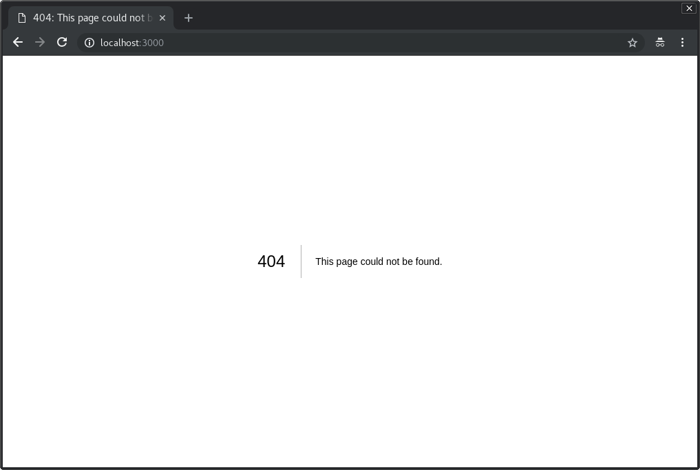

# Nextjs6 with Apollo Graphql and Material-UI Tutorial

## Install Yarn

The first method would be to use npm

```bash
npm install -g yarn
```

The other method would be to go to the official download page https://yarnpkg.com/en/docs/install and get the installer for your operating system and run it.

## Initialize project

To start, create a sample project by running the following commands:

```bash
mkdir github-client
cd github-client
yarn init
yarn add react react-dom prop-types next
mkdir pages
```

Then open the "package.json" in the github-client directory and add the following script.

```
{
  "scripts": {
    "dev": "next"
  }
}
```

Now everything is ready. Run the following command to start the dev server:

```bash
yarn dev
```

When you run `localhost:3000` you're gonna see this page:



## Babel

Babel is a toolchain that is mainly used to convert ECMAScript 2015+ code into a backwards compatible version of JavaScript in old browsers or environments.

```bash
yarn add babel-core -D
```

## Linters

Let's integrate linters to our app to avoid big refactoring in the future.

Add eslint as development dependency

```bash
yarn add eslint -D
```

babel-eslint allows you to lint ALL valid Babel code

```bash
yarn add babel-eslint -D
```

We're gonna use airbnb eslint config. There are few dependencies that are needed to be installed.

This package provides Airbnb's .eslintrc as an extensible shared config

```bash
yarn add eslint-config-airbnb -D
```

ESLint plugin with rules that help validate proper imports

```bash
yarn add eslint-plugin-import -D
```

Static AST checker for accessibility rules on JSX elements.

```bash
yarn add eslint-plugin-jsx-a11y -D
```

React specific linting rules for ESLint

```bash
yarn add eslint-plugin-react -D
```

Initialize eslint config

```bash
yarn run eslint --init
```

How would you like to configure ESLint? `Use a popular style guide`

Which style guide do you want to follow? `Airbnb`

Do you use React? `Yes`

What format do you want your config file to be in? `JSON`

Would you like to install them now with npm? `No`

Now we have `.eslintrc.json` with the following configuration

```js
{
  "extends": "airbnb"
}
```

We're gonna use `.js` extensions instead of `.jsx`. So we explicitly add this option to the `.eslintc.json`:

```js
{
  "parser": "babel-eslint",
  "rules": {
    "react/jsx-filename-extension": ["error", { "extensions": [".js", ".jsx"] }]
  },
  "extends": "airbnb"
}
```

## Material

We're gonna use material-ui library for styling. It's React components that implement Google's Material Design.

First of all we need to install some additional libraries:

```
yarn add jss
```

JSS is a more powerful abstraction over CSS. It uses JavaScript as a language to describe styles in a declarative and maintainable way. It is a high performance JS to CSS compiler which works at runtime and server-side.

```
yarn add react-jss
```

React-JSS provides components for JSS as a layer of abstraction.

Benefits compared to lower level core:

- Theming support.
- Critical CSS extraction.
- Lazy evaluation - sheet is created only when the component will mount.
- Auto attach/detach - sheet will be rendered to the DOM when the component is about to mount, and will be removed when no element needs it.
- A Style Sheet gets shared between all elements.
- Function values and rules are updated automatically with props.

```
yarn add styled-jsx
```

Full, scoped and component-friendly CSS support for JSX (rendered on the server or the client).

```
yarn add @material-ui/core @material-ui/icons
```

There is an example app that shows how to properly integrate material-ui specifically for nextjs framework. https://github.com/mui-org/material-ui/tree/master/examples/nextjs

Create `lib/getPageContext.js`

```js
/* eslint-disable no-underscore-dangle */

import { SheetsRegistry } from 'jss';
import { createMuiTheme, createGenerateClassName } from '@material-ui/core/styles';

// A theme with custom primary and secondary color.
// It's optional.
const theme = createMuiTheme();

function createPageContext() {
  return {
    theme,
    // This is needed in order to deduplicate the injection of CSS in the page.
    sheetsManager: new Map(),
    // This is needed in order to inject the critical CSS.
    sheetsRegistry: new SheetsRegistry(),
    // The standard class name generator.
    generateClassName: createGenerateClassName(),
  };
}

export default function getPageContext() {
  // Make sure to create a new context for every server-side request so that data
  // isn't shared between connections (which would be bad).
  if (!process.browser) {
    return createPageContext();
  }

  // Reuse context on the client-side.
  if (!global.__INIT_MATERIAL_UI__) {
    global.__INIT_MATERIAL_UI__ = createPageContext();
  }

  return global.__INIT_MATERIAL_UI__;
}
```

Next.js uses the App component to initialize pages. You can override it and control the page initialization. Which allows you to do amazing things like:

Persisting layout between page changes
Keeping state when navigating pages
Custom error handling using componentDidCatch
Inject additional data into pages (for example by processing GraphQL queries)

To override, create the `./pages/_app.js` file and override the App class as shown below:

```js
import React from 'react';
import App, { Container } from 'next/app';
import { MuiThemeProvider } from '@material-ui/core/styles';
import CssBaseline from '@material-ui/core/CssBaseline';
import JssProvider from 'react-jss/lib/JssProvider';
import getPageContext from '../lib/getPageContext';

class MainApp extends App {
  constructor(props) {
    super(props);
    this.pageContext = getPageContext();
  }

  pageContext = null;

  componentDidMount() {
    // Remove the server-side injected CSS.
    const jssStyles = document.querySelector('#jss-server-side');
    if (jssStyles && jssStyles.parentNode) {
      jssStyles.parentNode.removeChild(jssStyles);
    }
  }

  render() {
    const { Component, pageProps } = this.props;
    return (
      <Container>
        {/* Wrap every page in Jss and Theme providers */}
        <JssProvider
          registry={this.pageContext.sheetsRegistry}
          generateClassName={this.pageContext.generateClassName}
        >
          {/* MuiThemeProvider makes the theme available down the React
              tree thanks to React context. */}
          <MuiThemeProvider
            theme={this.pageContext.theme}
            sheetsManager={this.pageContext.sheetsManager}
          >
            {/* CssBaseline kickstart an elegant, consistent, and simple baseline to build upon. */}
            <CssBaseline />
            {/* Pass pageContext to the _document though the renderPage enhancer
                to render collected styles on server side. */}
            <Component pageContext={this.pageContext} {...pageProps} />
          </MuiThemeProvider>
        </JssProvider>
      </Container>
    );
  }
}

export default MainApp;
```

Pages in Next.js skip the definition of the surrounding document's markup. For example, you never include `<html>`, `<body>`, etc. To override that default behavior, you must create a file at `./pages/_document.js`, where you can extend the Document class.

We're gonna use codebase from the material-ui official repo example with nextjs:

```js
import React from 'react';
import PropTypes from 'prop-types';
import Document, { Head, Main, NextScript } from 'next/document';
import flush from 'styled-jsx/server';

class MainDocument extends Document {
  render() {
    const { pageContext } = this.props;

    return (
      <html lang="en" dir="ltr">
        <Head>
          <title>Github Client</title>
          <meta charSet="utf-8" />
          {/* Use minimum-scale=1 to enable GPU rasterization */}
          <meta
            name="viewport"
            content={
              'user-scalable=0, initial-scale=1, ' +
              'minimum-scale=1, width=device-width, height=device-height'
            }
          />
          {/* PWA primary color */}
          <meta name="theme-color" content={pageContext.theme.palette.primary.main} />
          <link
            rel="stylesheet"
            href="https://fonts.googleapis.com/css?family=Roboto:300,400,500"
          />
        </Head>
        <body>
          <Main />
          <NextScript />
        </body>
      </html>
    );
  }
}

MainDocument.getInitialProps = (ctx) => {
  // Resolution order
  //
  // On the server:
  // 1. app.getInitialProps
  // 2. page.getInitialProps
  // 3. document.getInitialProps
  // 4. app.render
  // 5. page.render
  // 6. document.render
  //
  // On the server with error:
  // 1. document.getInitialProps
  // 2. app.render
  // 3. page.render
  // 4. document.render
  //
  // On the client
  // 1. app.getInitialProps
  // 2. page.getInitialProps
  // 3. app.render
  // 4. page.render

  // Render app and page and get the context of the page with collected side effects.
  let pageContext;

  const page = ctx.renderPage((Component) => {
    const WrappedComponent = (props) => {
      pageContext = props.pageContext;

      return <Component {...props} />;
    };

    WrappedComponent.propTypes = {
      pageContext: PropTypes.shape({}).isRequired,
    };

    return WrappedComponent;
  });

  return {
    ...page,
    pageContext,
    // Styles fragment is rendered after the app and page rendering finish.
    styles: (
      <React.Fragment>
        <style
          id="jss-server-side"
          // eslint-disable-next-line react/no-danger
          dangerouslySetInnerHTML={{ __html: pageContext.sheetsRegistry.toString() }}
        />
        {flush() || null }
      </React.Fragment>
    ),
  };
};

export default MainDocument;
```

Now we're ready to implement some pages with components.

## Storybook

Storybook is a development environment for UI components. It allows you to browse a component library, view the different states of each component, and interactively develop and test components.

Startguide for react - https://storybook.js.org/basics/guide-react

First of all, you need to add @storybook/react to your project. To do that, simply run:

```bash
yarn add @storybook/react -D
```

Then add the following script to your package json in order to start the storybook later in this guide:

```json
{
  "scripts": {
    "storybook": "start-storybook -p 9001 -c .storybook"
  }
}
```

Create the config file

Storybook can be configured in several different ways. That’s why we need a config directory. We’ve added a `-c` option to the above script mentioning `.storybook` as the config directory.

For the basic Storybook configuration file, you don’t need to do much, but simply tell Storybook where to find stories.

To do that, simply create a file at `.storybook/config.js` with the following content:

```js
import { configure } from '@storybook/react';

const req = require.context('../components', true, /stories\.js$/);

function loadStories() {
  req.keys().forEach(req)
}

configure(loadStories, module);
```

Here we use Webpack’s require.context to load modules dynamically. Have a look at the relevant Webpack docs to learn more about how to use require.context.

Jest doesn't support webpack require.context. So we need to add babel plugin to make it work.

```bash
yarn add babel-plugin-require-context-hook -D
```

Update babel config:

`.babelrc`

```js
"test": {
  "presets": ["react", "env", "stage-0"],
  "plugins": [
    "require-context-hook"
  ]
}
```

Initialize require context hook in testConfig:

`lib/testConfig.js`

```js
import { configure } from 'enzyme';
import Adapter from 'enzyme-adapter-react-16';
import registerRequireContextHook from 'babel-plugin-require-context-hook/register';

registerRequireContextHook();

export default configure({ adapter: new Adapter() });
```

All files with `.stories` extension inside the `src/components` will be required dynamically.

Create separate babel config for storybook to avoid conflicts with different environments.

`.babelrc`

```js
{
  "presets": ["env", "stage-0", "react"]
}
```

Adjust eslint config (so we don't see warnings when importing storybook packages):

`.eslintrc.json`

```js
"import/no-extraneous-dependencies": ["error", { "devDependencies": true }]
```

Storybook is all about writing stories. Usually a story contains a single state of one of your components. That’s like a visual test case.

Technically, a story is a function that returns a React element.

We're gonna use atomic design methodology for our app.

Popularly known within the design world, Atomic Design helps to build consistent, solid and reusable design systems. Plus, in the world of React that stimulate the componentization, Atomic Design is used unconsciously; but when used in the right way, it becomes a powerful ally for developers.

Atomic design references:
https://cheesecakelabs.com/br/blog/atomic-design-react/
https://medium.com/@yejodido/atomic-components-managing-dynamic-react-components-using-atomic-design-part-1-5f07451f261f
https://github.com/Rulox/react-atomic-structure
https://github.com/danilowoz/react-atomic-design
http://ubie.io/atomic-design/

First of all create `index.js` entrypoint for components directory:

`components/index.js`

```js
const req = require.context('.', true, /\.\/[^/]+\/[^/]+\/index\.js$/);

req.keys().forEach((key) => {
  const componentName = key.replace(/^.+\/([^/]+)\/index\.js/, '$1');
  module.exports[componentName] = req(key).default;
});
```

Atomic Design should be a solution, not another problem. If you want to create a component and don't know where to put it (`atoms`, `molecules`, `organisms` etc.), do not worry, do not think too much, just put it anywhere. After you realize what it is, just move the component folder to the right place. Everything else should work.

This is possible because all components are dynamically exported on `components/index.js` and imported in a way that Atomic Design structure doesn't matter:

Let's create our first atom - material Button.

## Atoms

Atoms are the basic building blocks of matter. Applied to web interfaces, atoms are our HTML tags, such as a form label, an input or a button.

Atoms can also include more abstract elements like color palettes, fonts and even more invisible aspects of an interface like animations.

Like atoms in nature they’re fairly abstract and often not terribly useful on their own. However, they’re good as a reference in the context of a pattern library as you can see all your global styles laid out at a glance.

#### Buttom atom

`components/atoms/Button/index.js`

```js
import React from 'react';
import PropTypes from 'prop-types';
import { Button as MaterialButton } from '@material-ui/core';

const Button = (props) => {
  const { children, ...defaultProps } = props;

  return (
    <MaterialButton {...defaultProps}>
      {children}
    </MaterialButton>
  );
};

Button.propTypes = {
  children: PropTypes.node.isRequired,
};

export default Button;
```

And then story for this atom.

`components/atoms/Button/index.stories.js`

```js
import React from 'react';
import { action } from '@storybook/addon-actions';
import { storiesOf } from '@storybook/react';
import { Button } from '../..';

storiesOf('atoms/Button', module)
  .add('default', () => (
    <Button onClick={action('clicked')}>
      Default
    </Button>
  ))
  .add('outlined primary', () => (
    <Button variant="outlined" color="primary" onClick={action('clicked')}>
      Outline Primary
    </Button>
  ))
  .add('contained secondary', () => (
    <Button variant="contained" color="secondary" onClick={action('clicked')}>
      Contained Secondary
    </Button>
  ))
  .add('circle button', () => (
    <Button variant="fab" color="primary" aria-label="Add" onClick={action('clicked')}>
      CB
    </Button>
  ))
  .add('disabled button', () => (
    <Button variant="contained" color="primary" onClick={action('clicked')} disabled>
      Disabled Button
    </Button>
  ));
```

Run:

```bash
yarn storybook
```

Then we will see this:


## Add jest for testing

Add jest as development dependency

```bash
yarn add jest -D
```

Jest is a complete and ready to set-up JavaScript testing solution. Works out of the box for any React project.

Add enzyme

```bash
yarn add enzyme enzyme-adapter-react-16 -D
```

Enzyme is a JavaScript Testing utility for React that makes it easier to assert, manipulate, and traverse your React Components' output.

We need need different babel presets for test environment specifically for nextjs app.

`.babelrc`

```js
{
  "env": {
    "development": {
      "presets": ["next/babel"]
    },
    "production": {
      "presets": ["next/babel"]
    },
    "test": {
      "presets": ["react", "env", "stage-0"]
    }
  }
}
```

Enzyme expects an adapter to be configured

`lib/testConfig.js`

```js
import { configure } from 'enzyme';
import Adapter from 'enzyme-adapter-react-16';

export default configure({ adapter: new Adapter() });
```

Connect test config:

`package.json`

```js
"jest": {
  "setupTestFrameworkScriptFile": "./lib/testConfig.js"
}
```

Add to eslintrc.json. This will add all the jest related things to your environment, eliminating the linter errors/warnings:

```js
"env": {
  "jest": true
},
```

Add script for testing:

```js
{
  "scripts": {
    "test": "jest"
  }
}
```

Add simple test for out Button component:

```js
import React from 'react';
import { shallow } from 'enzyme';
import Button from '.';

describe('Button', () => {
  it('renders children when passed in', () => {
    const wrapper = shallow(<Button>Test</Button>);
    expect(wrapper.contains('Test')).toBe(true);
  });
});
```

Now if we run `yarn test` we should 1 passed spec.

Ok, let's add more simple components (atoms) which we will use for our home page.

#### AppBar atom

`components/atoms/AppBar/index.js`

```js
import React from 'react';
import PropTypes from 'prop-types';
import { AppBar as MaterialAppBar } from '@material-ui/core';

const AppBar = (props) => {
  const { children, ...defaultProps } = props;

  return (
    <MaterialAppBar {...defaultProps}>
      {children}
    </MaterialAppBar>
  );
};

AppBar.propTypes = {
  children: PropTypes.node.isRequired,
};

export default AppBar;
```

`components/atoms/AppBar/index.stories.js`

```js
import React from 'react';
import { storiesOf } from '@storybook/react';
import { AppBar } from '../..';

storiesOf('atoms/AppBar', module)
  .add('default', () => (
    <AppBar>
      <div>Example of AppBar</div>
    </AppBar>
  ))
  .add('secondary', () => (
    <AppBar color="secondary">
      <div>Secondary color</div>
    </AppBar>
  ));
```

`components/atoms/AppBar/index.test.js`

```js
import React from 'react';
import { shallow } from 'enzyme';
import AppBar from '.';

describe('AppBar', () => {
  it('renders children when passed in', () => {
    const wrapper = shallow(<AppBar><div>test</div></AppBar>);
    expect(wrapper.contains(<div>test</div>)).toBe(true);
  });
});
```

#### Card atom

`components/atoms/Card/index.js`

```js
import React from 'react';
import PropTypes from 'prop-types';
import { Card as MaterialCard } from '@material-ui/core';

const Card = (props) => {
  const { children, ...defaultProps } = props;

  return (
    <MaterialCard {...defaultProps}>
      {children}
    </MaterialCard>
  );
};

Card.propTypes = {
  children: PropTypes.node.isRequired,
};

export default Card;
```

`components/atoms/Card/index.stories.js`

```js
import React from 'react';
import { storiesOf } from '@storybook/react';
import { Card } from '../..';

storiesOf('atoms/Card', module)
  .add('default', () => (
    <Card>
      Default
    </Card>
  ));
```

`components/atoms/Card/index.test.js`

```js
import React from 'react';
import { shallow } from 'enzyme';
import Card from '.';

describe('Card', () => {
  it('renders children when passed in', () => {
    const wrapper = shallow(
      <Card>
        <p>Some text</p>
        <p>Test</p>
      </Card>,
    );
    expect(wrapper.contains('Test')).toBe(true);
    expect(wrapper.contains('Some text')).toBe(true);
  });
});
```

#### CardActions atom

`components/atoms/CardActions/index.js`

```js
import React from 'react';
import PropTypes from 'prop-types';
import { CardActions as MaterialCardActions } from '@material-ui/core';

const CardActions = (props) => {
  const { children, ...defaultProps } = props;

  return (
    <MaterialCardActions {...defaultProps}>
      {children}
    </MaterialCardActions>
  );
};

CardActions.propTypes = {
  children: PropTypes.node.isRequired,
};

export default CardActions;
```

`components/atoms/CardActions/index.stories.js`

```js
import React from 'react';
import { storiesOf } from '@storybook/react';
import { CardActions, Button } from '../..';

storiesOftoms/CardActions', module)
  .add('with button', () => (
    <CardActions>
      <Button>Button</Button>
    </CardActions>
  ));
```

`components/atoms/CardActions/index.test.js`

```js
import React from 'react';
import { shallow } from 'enzyme';
import CardActions from '.';

describe('CardActions', () => {
  it('renders children when passed in', () => {
    const wrapper = shallow(
      <CardActions>
        <p>Some text</p>
        <p>Test</p>
      </CardActions>,
    );
    expect(wrapper.contains('Test')).toBe(true);
    expect(wrapper.contains('Some text')).toBe(true);
  });
});
```

#### CardContent atom

`components/atoms/CardContent/index.js`

```js
import React from 'react';
import PropTypes from 'prop-types';
import { CardContent as MaterialCardContent } from '@material-ui/core';

const CardContent = (props) => {
  const { children, ...defaultProps } = props;

  return (
    <MaterialCardContent {...defaultProps}>
      {children}
    </MaterialCardContent>
  );
};

CardContent.propTypes = {
  children: PropTypes.node.isRequired,
};

export default CardContent;
```

`components/atoms/CardContent/index.stories.js`

```js
import React from 'react';
import { storiesOf } from '@storybook/react';
import { CardContent } from '../..';

storiesOfardContent', module)
  .add('default', () => (
    <CardContent>
      <p>Lorem</p>
      <p>Lorem Ipsum</p>
    </CardContent>
  ));
```

`components/atoms/CardContent/index.test.js`

```js
import React from 'react';
import { shallow } from 'enzyme';
import CardContent from '.';

describe('CardContent', () => {
  it('renders children when passed in', () => {
    const wrapper = shallow(
      <CardContent>
        <p>Lorem</p>
        <p>Ipsum</p>
      </CardContent>,
    );
    expect(wrapper.contains('Lorem')).toBe(true);
    expect(wrapper.contains('Ipsum')).toBe(true);
  });
});
```

We're gonna create few more atoms using same approach:

- IconButton
- List
- ListItem
- MenuIcon
- SwipeableDrawer
- Toolbar
- Typography

## Moleculus

Molecules are groups of two or more atoms held together by chemical bonds. These combinations of atoms take on their own unique properties, and become more tangible and operational than atoms.

Things start getting more interesting and tangible when we start combining atoms together. Molecules are groups of atoms bonded together and are the smallest fundamental units of a compound. These molecules take on their own properties and serve as the backbone of our design systems.

For example, a form label, input or button aren’t too useful by themselves, but combine them together as a form and now they can actually do something together.

Building up to molecules from atoms encourages a “do one thing and do it well” mentality. While molecules can be complex, as a rule of thumb they are relatively simple combinations of atoms built for reuse.

#### SideBarMenu Molecule

Now we gonna create first moleculue component. It will be Sidebar Menu which will consist of atoms.

`components/moleculus/SideBarMenu/index.js`

```js
import React from 'react';
import PropTypes from 'prop-types';

import {
  List, ListItem, ListItemText,
} from '../..';

const SideBarMenu = (props) => {
  const { menuItems } = props;

  return (
    <List>
      {menuItems.map(item => (
        <ListItem key={item} button>
          <ListItemText primary={item} />
        </ListItem>
      ))}
    </List>
  );
};

SideBarMenu.propTypes = {
  menuItems: PropTypes.arrayOf(PropTypes.string).isRequired,
};

export default SideBarMenu;
```

`components/moleculus/SideBarMenu/index.stories.js`

```js
import React from 'react';
import { storiesOf } from '@storybook/react';
import { SideBarMenu } from '../..';

storiesOfoleculus/SideBarMenu', module)
  .add('default', () => (
    <SideBarMenu menuItems={['First', 'Second', 'Third']} />
  ));
```

`components/moleculus/SideBarMenu/index.test.js`

```js
import React from 'react';
import { shallow } from 'enzyme';
import SideBarMenu from '.';
import { ListItem, ListItemText, SwipeableDrawer } from '../..';

describe('SideBarMenu', () => {
  it('renders correct menu items using array of strings as props', () => {
    const mockedOpenMenu = jest.fn();
    mockedOpenMenu.mockReturnValueOnce(true);

    const mockedCloseMenu = jest.fn();
    mockedCloseMenu.mockReturnValueOnce(true);

    const wrapper = shallow(
      <SideBarMenu
        menuItems={['foo', 'bar', 'baz']}
        openMenu={mockedOpenMenu}
        closeMenu={mockedCloseMenu}
      />,
    );

    expect(wrapper.find(ListItem)).toHaveLength(3);

    const swipeableDrawer = wrapper.find(SwipeableDrawer);
    expect(swipeableDrawer.props().onClose()).toEqual(true);
    expect(swipeableDrawer.props().onOpen()).toEqual(true);

    const props = wrapper.find(ListItemText).map(node => node.props().primary);
    expect(props).toEqual(['foo', 'bar', 'baz']);
  });
});
```

#### Header molecule

`components/moleculus/Header/index.js`

```js
import React from 'react';
import PropTypes from 'prop-types';
import { withStyles } from '@material-ui/core/styles';

import {
  AppBar, IconButton,
  MenuIcon, Toolbar, Typography,
} from '../..';

const styles = {
  root: {
    flexGrow: 1,
  },
  flex: {
    flexGrow: 1,
  },
  menuButton: {
    marginLeft: -12,
    marginRight: 20,
  },
};

const Header = (props) => {
  const {
    classes, swipeableMenu, loginButton, title,
  } = props;

  return (
    <div className={classes.root}>
      <AppBar position="static">
        {swipeableMenu}
        <Toolbar>
          <IconButton className={classes.menuButton} color="inherit" aria-label="Menu">
            <MenuIcon />
          </IconButton>
          <Typography variant="title" color="inherit" className={classes.flex}>
            {title}
          </Typography>
          {loginButton}
        </Toolbar>
      </AppBar>
    </div>
  );
};

Header.propTypes = {
  swipeableMenu: PropTypes.node,
  loginButton: PropTypes.node,
  classes: PropTypes.node.isRequired,
  title: PropTypes.string,
};

Header.defaultProps = {
  swipeableMenu: null,
  loginButton: null,
  title: null,
};

export default withStyles(styles)(Header);
```

`components/moleculus/Header/index.stories.js`

```js
import React from 'react';
import { storiesOf } from '@storybook/react';
import { Header } from '../..';

storiesOf('moleculus/Header', module)
  .add('default', () => (
    <Header />
  ))
  .add('with title', () => (
    <Header title="Home" />
  ));
```

`components/moleculus/Header/index.test.js`

```js
import React from 'react';
import { mount } from 'enzyme';
import { Header, Typography } from '../..';

describe('Header', () => {
  it('renders header with correct title', () => {
    const wrapper = mount(<Header title="foo" />);
    const typographyNode = wrapper.find(Typography);

    expect(typographyNode.text()).toEqual('foo');
  });
});
```

#### SimpleCard molecule

`index.js`

```js
import React from 'react';
import PropTypes from 'prop-types';
import { withStyles } from '@material-ui/core/styles';

import {
  Card, CardContent, Typography, CardActions, Button,
} from '../..';

const styles = {
  card: {
    minWidth: 100,
  },
  bullet: {
    display: 'inline-block',
    margin: '0 2px',
    transform: 'scale(0.8)',
  },
  title: {
    marginBottom: 16,
    fontSize: 14,
  },
  pos: {
    marginBottom: 12,
  },
};

const SimpleCard = (props) => {
  const { classes, title, description } = props;

  return (
    <Card className={classes.card}>
      <CardContent>
        <Typography variant="headline" component="h2">
          {title}
        </Typography>
        <Typography className={classes.pos} color="textSecondary">
          {description}
        </Typography>
      </CardContent>
      <CardActions>
        <Button size="small">Learn More</Button>
      </CardActions>
    </Card>
  );
};

SimpleCard.propTypes = {
  classes: PropTypes.shape({}).isRequired,
  title: PropTypes.string.isRequired,
  description: PropTypes.string.isRequired,
};

export default withStyles(styles)(SimpleCard);
```

`index.stories.js`

```js
import React from 'react';
import { storiesOf } from '@storybook/react';
import { SimpleCard } from '../..';

storiesOf('moleculus/SimpleCard', module)
  .add('default', () => (
    <SimpleCard title="Default title" description="Default description" />
  ));
```

`index.test.js`

```js
import React from 'react';
import { mount } from 'enzyme';
import { SimpleCard, Typography } from '../..';

describe('SimpleCard', () => {
  it('renders header with correct title', () => {
    const wrapper = mount(<SimpleCard title="foo" description="bar" />);
    const typographyNodes = wrapper.find(Typography);
    expect(typographyNodes.first().text()).toEqual('foo');
    expect(typographyNodes.last().text()).toEqual('bar');
  });
});
```

## Organisms

Molecules give us some building blocks to work with, and we can now combine them together to form organisms. Organisms are groups of molecules joined together to form a relatively complex, distinct section of an interface.

We’re starting to get increasingly concrete. A client might not be terribly interested in the molecules of a design system, but with organisms we can see the final interface beginning to take shape. Dan Mall (who I’m working with on several projects) uses element collages, which articulate ideas for a few key organisms to facilitate client conversations and shape the visual direction (all without having to construct full comps).

Organisms can consist of similar and/or different molecule types. For example, a masthead organism might consist of diverse components like a logo, primary navigation, search form, and list of social media channels. But a “product grid” organism might consist of the same molecule (possibly containing a product image, product title and price) repeated over and over again.

Building up from molecules to organisms encourages creating standalone, portable, reusable components.

#### Header with swipeable menu organism

`components/organisms/HeaderWithMenu/index.js`

```js
import React from 'react';
import { Header, SwipeableMenu } from '../..';

class HeaderWithMenu extends React.Component {
  state = {
    leftMenuIsOpened: false,
  };

  toggleLeftMenuShow = leftMenuIsOpened => () => {
    this.setState({
      leftMenuIsOpened,
    });
  };

  render() {
    const {
      state: {
        leftMenuIsOpened,
      },
      toggleLeftMenuShow,
    } = this;

    return (
      <Header
        openMenu={toggleLeftMenuShow(true)}
        title="Home"
        swipeableMenu={(
          <SwipeableMenu
            isOpenedByDefault={leftMenuIsOpened}
            closeMenu={toggleLeftMenuShow(false)}
            openMenu={toggleLeftMenuShow(true)}
            menuItems={['Trending']}
          />
        )}
      />
    );
  }
}

export default HeaderWithMenu;
```

`components/organisms/HeaderWithMenu/index.stories.js`

```js
import React from 'react';
import { storiesOf } from '@storybook/react';
import { HeaderWithMenu } from '../..';

storiesOf('organisms/HeaderWithMenu', module)
  .add('default', () => (
    <HeaderWithMenu />
  ));
```

`components/organisms/HeaderWithMenu/index.test.js`

```js
import React from 'react';
import { shallow } from 'enzyme';
import { HeaderWithMenu } from '../..';

describe('HeaderWithMenu', () => {
  it('renders component', () => {
    const wrapper = shallow(<HeaderWithMenu />);

    const header = wrapper.find(Header);
    expect(header).toHaveLength(1);
    expect(header.props().title).toEqual('Home');
    expect(header.props().swipeableMenu).toBeDefined();
  });
});
```

## Templates

Templates are page-level objects that place components into a layout and articulate the design’s underlying content structure. To build on our previous example, we can take the HeaderWithMenu organism and apply it to a home template.

This Home template displays all the necessary page components functioning together, which provides context for these relatively abstract molecules and organisms. When crafting an effective design system, it’s critical to demonstrate how components look and function together in the context of a layout to prove the parts add up to a well-functioning whole.

Another important characteristic of templates is that they focus on the page’s underlying content structure rather than the page’s final content. Design systems must account for the dynamic nature of content, so it’s very helpful to articulate important properties of components like image sizes and character lengths for headings and text passages.

#### Home template

`index.js`

```js
import React from 'react';
import PropTypes from 'prop-types';
import { withStyles } from '@material-ui/core/styles';
import { Grid } from '@material-ui/core';
import Router from 'next/router';

import {
  HeaderWithMenu, SimpleCard,
} from '../..';

const styles = {
  container: {
    'overflow-x': 'hidden',
  },
};

class Home extends React.PureComponent {
  static propTypes = {
    classes: PropTypes.shape({}).isRequired,
    cards: PropTypes.arrayOf(PropTypes.shape({
      title: PropTypes.string,
      description: PropTypes.string,
    })),
  };

  static defaultProps = {
    cards: [],
  };

  render() {
    const { props: { cards } } = this;

    return (
      <div>
        <HeaderWithMenu />
        <div style={{ padding: 12 }}>
          <Grid container spacing={24} style={{ padding: 24 }}>
            {cards.map(card => (
              <Grid key={card.title} item xs={6} sm={4} lg={3} xl={2}>
                <SimpleCard
                  title={card.title}
                  description={card.description}
                />
              </Grid>
            ))}
          </Grid>
        </div>
      </div>
    );
  }
}

export default withStyles(styles)(Home);
```

`index.stories.js`

```js
import React from 'react';
import { storiesOf } from '@storybook/react';
import { Home } from '../..';

storiesOf('templates/Home', module)
  .add('default', () => (
    <Home
      cards={[
        { title: 'foo', description: 'bar' },
        { title: 'baz', description: 'craz' },
        { title: 'saz', description: 'taz' },
      ]}
    />
  ));
```

`index.test.js`

```js
import React from 'react';
import { mount } from 'enzyme';
import { Home, SimpleCard } from '../..';

describe('Home', () => {
  it('renders component', () => {
    const wrapper = mount(
      <Home
        cards={[
          { title: '1', description: 'first' },
          { title: '2', description: 'second' },
        ]}
      />,
    );

    expect(wrapper.find(SimpleCard)).toHaveLength(2);
  });
});
```

## Pages

Now we can use nextjs pages as an entry point

`index.js`

```js
import React from 'react';
import { Home } from '../components';

const Index = () => (
  <Home />
);

export default Index;
```

The file-system is the main API. Every .js file becomes a route that gets automatically processed and rendered.

Now if we run `yarn dev` we can access this page on `localhost:3000`

## Snapshot testing

Snapshot tests are a very useful tool whenever you want to make sure your UI does not change unexpectedly.

A typical snapshot test case for a mobile app renders a UI component, takes a screenshot, then compares it to a reference image stored alongside the test. The test will fail if the two images do not match: either the change is unexpected, or the screenshot needs to be updated to the new version of the UI component.

Add react-test-renderer

```bash
yarn add react-test-renderer -D
```

This package provides a React renderer that can be used to render React components to pure JavaScript objects, without depending on the DOM or a native mobile environment.

`__tests__/index.test.js`

```js
import React from 'react';
import renderer from 'react-test-renderer';
import Index from '../pages';

describe('Home Page', () => {
  it('matches snapshot', () => {
    const component = renderer.create(<Index />);
    const tree = component.toJSON();
    expect(tree).toMatchSnapshot();
  });
});
```

## Authentication

To communicate with github graphql api we need to create a github application first. Follow these steps to create your github app https://developer.github.com/apps/building-github-apps/creating-a-github-app/

For development environment Homepage URL - http://localhost:3000, Authorization callback URL - http://localhost:3000/auth/github/callback

#### Add github app secret keys

We can use `next.config.js` for storing secret api keys. Which will be available only on server side.

`next.config.js`

```js
module.exports = {
  serverRuntimeConfig: {
    GithubClientId: '<ClientId>',
    GithubClientSecret: '<ClientSecret>',
  },
};
```

Add this file to `.gitignore`

#### Github login page

We need login page which will be just some kind of loader. The main purpose of this page is to make request to github authentication endpoint and redirect to our callback page.

Start with atom

`components/atoms/Loader/index.js`

```js
import React from 'react';
import CircularProgress from '@material-ui/core/CircularProgress';

const Loader = props => (
  <CircularProgress {...props} />
);

export default Loader;
```

`components/templates/GithubLogin/index.js`

```js
import React from 'react';
import { Grid } from '@material-ui/core';
import { HeaderWithMenu, Loader } from '../..';

const GithubLogin = () => (
  <div>
    <HeaderWithMenu />
    <div style={{ padding: 12 }}>
      <Grid direction="row" justify="center" container spacing={24} style={{ padding: 24 }}>
        <Loader size={500} />
      </Grid>
    </div>
  </div>
);

export default GithubLogin;
```

`pages/auth/github/login.js`

```js
import React from 'react';
import getConfig from 'next/config';
import { GithubLogin } from '../../../components';

class Login extends React.Component {
  static async getInitialProps({ res }) {
    const { serverRuntimeConfig: { GithubClientId } } = getConfig();

    if (res) {
      res.writeHead(302, {
        Location: `https://github.com/login/oauth/authorize?client_id=${GithubClientId}`,
      });
      res.end();
    }

    return {};
  }

  render() {
    return (
      <GithubLogin />
    );
  }
}

export default Login;
```

`getInitialProps` is an async static method. It can asynchronously fetch anything that resolves to a JavaScript plain Object, which populates props.

Data returned from `getInitialProps` is serialized when server rendering, similar to a `JSON.stringify`. Make sure the returned object from `getInitialProps` is a plain Object and not using `Date`, `Map` or `Set`.

For the initial page load, `getInitialProps` will execute on the server only. `getInitialProps` will only be executed on the client when navigating to a different route via the Link component or using the routing APIs.

`__tests__/auth/github/login.test.js`

```js
import React from 'react';
import renderer from 'react-test-renderer';
import Login from '../../../pages/auth/github/login';

describe('Github Login Page', () => {
  it('matches snapshot', () => {
    const component = renderer.create(<Login />);
    const tree = component.toJSON();
    expect(tree).toMatchSnapshot();
  });
});
```

#### Callback page

We need to implement callback page which will be used to obtain `access_token`.

Install `isomorphic-unfetch` (Tiny 500b `fetch` "barely-polyfill"). We will use this package for authentication REST requests only.

```bash
yarn add isomorphic-unfetch
```

We need to store `access_token` on a client side using cookies. A simple, lightweight JavaScript API for handling cookies.

```bash
yarn add js-cookie
```

`pages/auth/github/callback.js`

```js
import React from 'react';
import Router, { withRouter } from 'next/router';
import fetch from 'isomorphic-unfetch';
import getConfig from 'next/config';
import Cookies from 'js-cookie';
import PropTypes from 'prop-types';
import { GithubLogin } from '../../../components';

class Callback extends React.Component {
  static propTypes = {
    errorMessage: PropTypes.string,
    accessToken: PropTypes.string,
  };

  static defaultProps = {
    errorMessage: undefined,
    accessToken: undefined,
  };

  componentDidMount() {
    const { accessToken } = this.props;

    if (accessToken) {
      Router.push('/');
    }
  }

  static async getInitialProps({ query }) {
    const { serverRuntimeConfig: { GithubClientId, GithubClientSecret } } = getConfig();

    const bodyData = JSON.stringify({
      client_id: GithubClientId,
      client_secret: GithubClientSecret,
      code: query.code,
    });

    const res = await fetch('https://github.com/login/oauth/access_token', {
      headers: {
        Accept: 'application/json',
        'Content-Type': 'application/json',
      },
      method: 'POST',
      body: bodyData,
    });

    const json = await res.json();
    const errorMessage = json.error_description;
    return { errorMessage, accessToken: json.access_token };
  }

  render() {
    const { errorMessage, accessToken } = this.props;

    if (errorMessage) {
      return (
        <GithubLogin error={errorMessage} />
      );
    }

    Cookies.set('access_token', accessToken);

    return null;
  }
}

export default withRouter(Callback);
```

## GraphQL with Apollo

Apollo Client is the best way to use GraphQL to build client applications. The client is designed to help you quickly build a UI that fetches data with GraphQL, and can be used with any JavaScript front-end.

With Apollo’s declarative approach to data fetching, all of the logic for retrieving your data, tracking loading and error states, and updating your UI is encapsulated in a single Query component. This encapsulation makes composing your Query components with your presentational components a breeze! Let’s see what this looks like in practice with React Apollo.

The simplest way to get started with Apollo Client is by using Apollo Boost. It's starter kit that configures your client for you with recommended settings.

Let’s install packages:

```bash
yarn add apollo-boost react-apollo graphql
```

- `apollo-boost` Package containing everything you need to set up Apollo Client
- `react-apollo` View layer integration for React
- `graphql` Also parses your GraphQL queries

Great, now that you have all the dependencies you need, let’s create your Apollo Client. The only thing you need to get started is the endpoint for your GraphQL server. If you don’t pass in uri directly, it defaults to the /graphql endpoint on the same host your app is served from.

In our `_app.js` file, let’s import ApolloClient from apollo-boost and add the endpoint for Github GraphQL server to the uri property of the client config object.

`pages/_app.js`

```js

```


## Draft (remove later)

Babel plugin resolver

```bash
yarn add babel-plugin-module-resolver -D
```

```js
"plugins": [
  ["module-resolver", {
    "root": ["."],
    "alias": {
      "components": "./components"
    }
  }]
]
```


Add fetch

```
yarn add isomorphic-unfetch
```

Add cookies manager lib

```
yarn add js-cookie
```

For snapshot testing:

```bash
yarn add react-test-renderer -D
```

Add script into `package.json` to run tests:

```js
"scripts": {
  "dev": "next",
  "test": "NODE_ENV=test jest"
}
```


Specify Jest Jest global variables in `.eslintrc.json`:

```js
{
  "env": {
    "jest": true
  },
  "extends": "airbnb"
}
```

`.babelrc`:

```js
{
  "env": {
    "development": {
      "presets": ["next/babel"]
    },
    "production": {
      "presets": ["next/babel"]
    },
    "test": {
      "presets": [["next/babel", { "preset-env": { "modules": "commonjs" } }]]
    }
  }
}
```

## Material-UI

Add material-ui for styled components to nextjs app

```bash
yarn add @material-ui/core
```

## Authentication

To communicate with github graphql api we need to create a github application first. Follow these steps to create your github app https://developer.github.com/apps/building-github-apps/creating-a-github-app/

For development environment Homepage URL - http://localhost:3000, Authorization callback URL - http://localhost:3000/auth/github/callback

Store client ID and client secret in `env-config.js`. Add this file to `.gitignore`

```js
module.exports = {
  serverRuntimeConfig: { // Will only be available on the server side
    githubClientId: 'secret',
    githubClientSecret: 'secret',
  },
};
```

Add `isomorphic-unfetch` for async calls

```bash
yarn add isomorphic-unfetch
```

Cookie package for storing access_token

```bash
yarn add js-cookie
```
